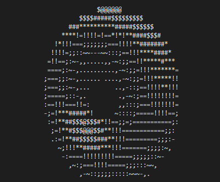

# Donuts! 🍩

Donuts for all your donut needs!

Based on spinning ASCII Donut: https://www.a1k0n.net/2011/07/20/donut-math.html

## Flavors

* C
* Python

## Reference

https://gist.github.com/gcr/1075131

https://github.com/hadal1337/ASCII-Doughnut/blob/master/ASCII%20Doughnut.cpp

